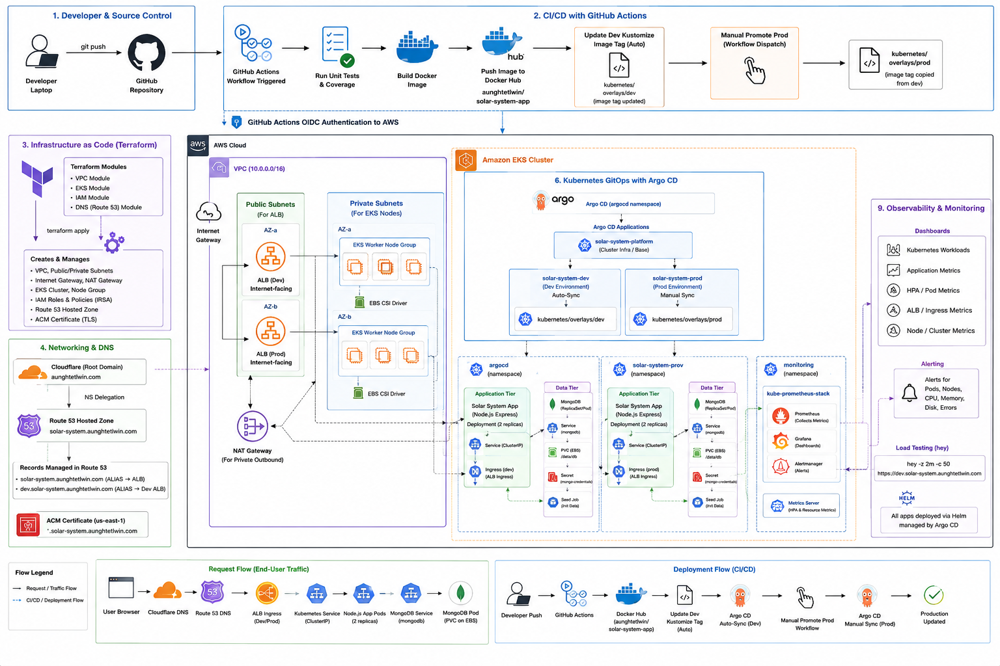
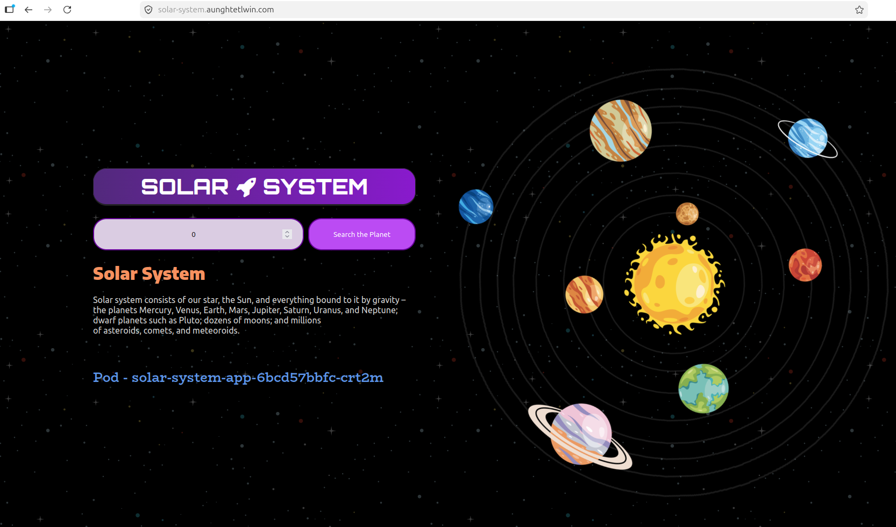
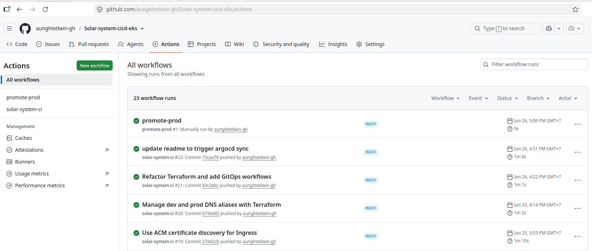
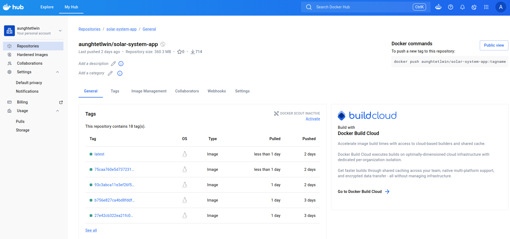
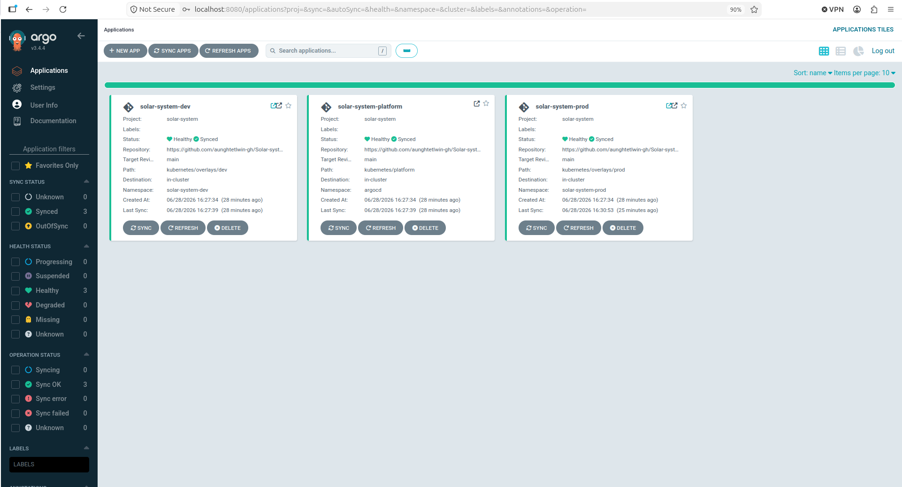
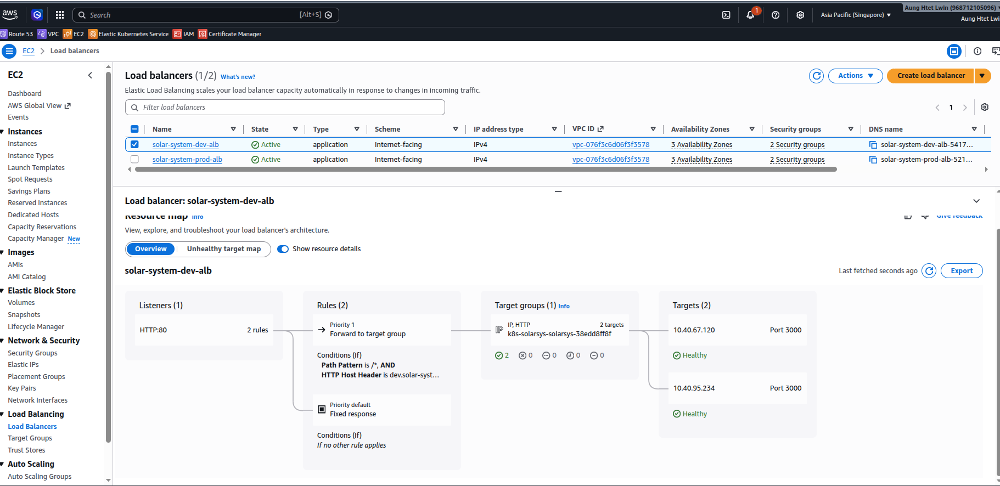
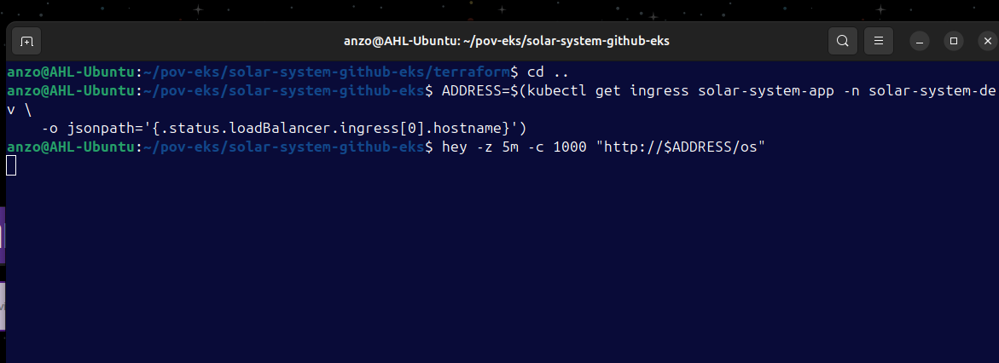
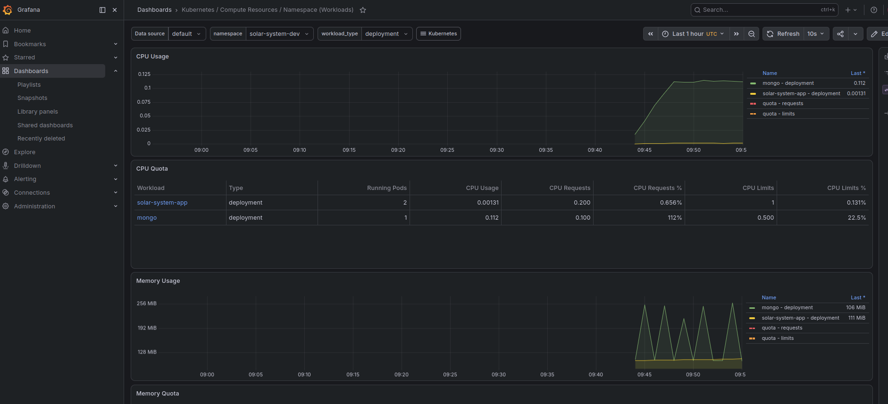
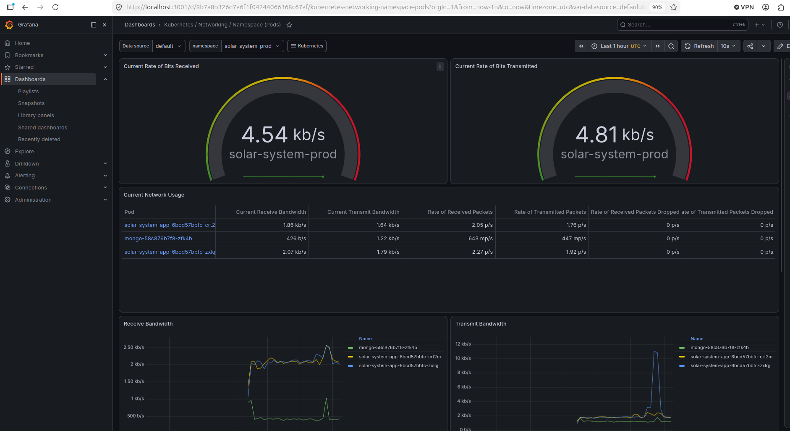

# Solar System CI/CD on AWS EKS

End-to-end DevOps portfolio project for a Node.js, Express, and MongoDB Solar System app deployed to AWS EKS with Docker, Terraform, GitHub Actions, Argo CD, Route 53, ACM, Cloudflare DNS, Prometheus, and Grafana.



## What This Project Shows

- Containerized Node.js application with MongoDB
- Docker image publishing to Docker Hub
- GitHub Actions CI with tests, coverage, Docker build, smoke test, and image push
- GitOps deployment with Argo CD
- Automatic dev deployment and manual prod promotion
- Terraform-managed AWS infrastructure with modules
- EKS workloads with Ingress, ALB, HPA, PVC, Secrets, and seed Job
- HTTPS production domain with Route 53, ACM, and Cloudflare delegation
- Observability with Prometheus and Grafana

## Stack

- **App**: Node.js 22, Express, MongoDB 7
- **CI/CD**: GitHub Actions, Docker Hub, Argo CD
- **Infrastructure**: Terraform, AWS VPC, EKS, IAM, Route 53, ACM
- **Kubernetes**: Deployments, Services, Ingress, HPA, PVC, Secrets, Jobs
- **Networking**: AWS Load Balancer Controller, ALB, Cloudflare DNS
- **Observability**: kube-prometheus-stack, Prometheus, Grafana

## Architecture Summary

This is a three-tier containerized application:

- **Access tier**: Cloudflare delegates `solar-system.aunghtetlwin.com` to Route 53. AWS ALB Ingress handles HTTP/HTTPS traffic with ACM TLS.
- **Application tier**: Node.js/Express runs in EKS dev and prod namespaces.
- **Data tier**: MongoDB runs inside Kubernetes with EBS-backed persistent storage through the EBS CSI driver.

## Deployment Flow

```text
Developer -> GitHub -> GitHub Actions -> Docker Hub
                              |
                              v
                         dev Kustomize tag(kustomization.yaml)
                              |
                              v
                          Argo CD dev

Manual promotion:

GitHub Actions promote-prod -> prod Kustomize tag -> Argo CD prod
```

## Infrastructure Flow

```text
Terraform -> VPC -> EKS -> IAM/OIDC -> Route 53/ACM
Argo CD   -> Kubernetes manifests -> Ingress -> AWS Load Balancer Controller -> ALB
```

## Terraform Modules

```text
terraform/modules/vpc  - VPC, public/private subnets, NAT, routes
terraform/modules/eks  - EKS cluster, node group, addons, IRSA roles
terraform/modules/iam  - GitHub Actions OIDC access to EKS
terraform/modules/dns  - Route 53, ACM, dev/prod DNS records
```

## GitOps Environments

```text
solar-system-dev   - auto-sync enabled
solar-system-prod  - manual sync/promotion
argocd             - Argo CD control plane
monitoring         - Prometheus and Grafana
```

## Live URLs

```text
Production:  https://solar-system.aunghtetlwin.com
Development: http://dev.solar-system.aunghtetlwin.com
```

## Project Evidence

Production application running through Cloudflare DNS, Route 53, ACM, ALB, and EKS:



GitHub Actions CI/CD and manual production promotion workflow:



Docker Hub repository with commit SHA and `latest` image tags:



Argo CD applications synced and healthy:



AWS Load Balancer Controller-created ALBs:



Load test against the dev ALB:



Grafana workload dashboard:



Grafana networking dashboard:



## Documentation

- [Operations Runbook](docs/OPERATIONS_RUNBOOK.md)
- [CI/CD Reference](docs/CI.md)
- [Rebuild and Destroy Runbook](docs/REBUILD_AND_DEPLOY.md)
- [Architecture Diagram Prompt](docs/ARCHITECTURE_DIAGRAM_PROMPT.md)

## Quick Verification

```bash
kubectl get applications -n argocd
kubectl get ingress -A
kubectl get hpa -A
curl -I https://solar-system.aunghtetlwin.com
curl -I http://dev.solar-system.aunghtetlwin.com
```

Expected:

```text
Argo CD apps: Synced / Healthy
Domains: HTTP 200
```

Example healthy state:

```text
kubectl get applications -n argocd

NAME                    SYNC STATUS   HEALTH STATUS
solar-system-dev        Synced        Healthy
solar-system-platform   Synced        Healthy
solar-system-prod       Synced        Healthy
```

```text
kubectl get ingress -A

NAMESPACE           NAME               CLASS   HOSTS                               ADDRESS
solar-system-dev    solar-system-app   alb     dev.solar-system.aunghtetlwin.com   solar-system-dev-alb-...
solar-system-prod   solar-system-app   alb     solar-system.aunghtetlwin.com       solar-system-prod-alb-...
```

```text
kubectl get hpa -A

NAMESPACE           NAME               REFERENCE                     TARGETS                        MINPODS   MAXPODS   REPLICAS
solar-system-dev    solar-system-app   Deployment/solar-system-app   cpu: 1%/60%, memory: 46%/75%   2         6         2
solar-system-prod   solar-system-app   Deployment/solar-system-app   cpu: 1%/60%, memory: 46%/75%   2         6         2
```

```text
curl -I https://solar-system.aunghtetlwin.com
HTTP/2 200

curl -I http://dev.solar-system.aunghtetlwin.com
HTTP/1.1 200 OK
```

## Notes

- MongoDB runs inside Kubernetes for portfolio/lab purposes. For production, use a managed database such as MongoDB Atlas, Amazon DocumentDB, or another managed service.
- Dev deploys automatically from GitOps. Prod is manually promoted.
- The legacy direct Kubernetes manifests remain in `kubernetes/eks/`, but the main deployment path is Argo CD.
